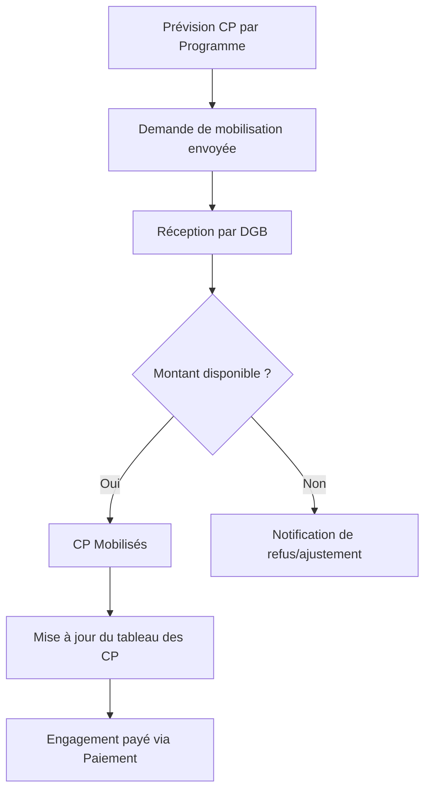

# Module Prévisions & Mobilisation des CP

## 📌 **Objectif**

Ce module permet aux utilisateurs de :

- Planifier les crédits nécessaires au règlement des engagements.
- Demander officiellement la **mobilisation des CP** auprès de la DGB.
- Suivre en temps réel l'évolution des **CP prévus, mobilisés et consommés**.
- Anticiper les **écarts ou retards de mobilisation**.

## 🧩 **Fonctionnalités principales**

| Fonctionnalité                  | Description                                                                                                      |
| ------------------------------- | ---------------------------------------------------------------------------------------------------------------- |
| 📅 **Prévisions périodiques**   | L'utilisateur saisit les prévisions CP par programme ou opération, avec une répartition mensuelle/trimestrielle. |
| 🧾 **Demande de mobilisation**  | Formulaire dédié pour transmettre à la DGB une demande de mise à disposition des CP.                             |
| 🔄 **Suivi de la mobilisation** | Affiche les montants mobilisés vs montants prévus avec visualisation des écarts.                                 |
| 📊 **Tableaux & Graphiques**    | Vue synthétique avec filtres (ministère, programme, période, statut).                                            |
| 🔔 **Alertes automatiques**     | Notifie l'utilisateur si les montants mobilisés sont en retard ou inférieurs aux besoins.                        |

## 🧾 **Structure de la table `prevision_cp`**

| Champ              | Type    | Description                                                           |
| ------------------ | ------- | --------------------------------------------------------------------- |
| `id`               | UUID    | Identifiant unique                                                    |
| `programme_id`     | UUID    | Clé étrangère vers le programme concerné                              |
| `exercice`         | INT     | Année concernée                                                       |
| `periode`          | VARCHAR | Mois ou trimestre (ex: `2024-Q1`)                                     |
| `montant_prevu`    | DECIMAL | Montant prévu de CP                                                   |
| `montant_demande`  | DECIMAL | Montant de CP demandé à la DGB                                        |
| `montant_mobilise` | DECIMAL | Montant effectivement mobilisé                                        |
| `montant_consomme` | DECIMAL | Montant payé sur les CP mobilisés                                     |
| `statut`           | ENUM    | `prévu`, `demandé`, `mobilisé`, `en retard`, `partiellement mobilisé` |
| `date_soumission`  | DATE    | Date d'envoi de la demande de mobilisation                            |
| `notes`            | TEXT    | Commentaires ou précisions                                            |

## 🔁 **Workflow de Mobilisation des CP**

## 📈 **Écrans de l'application**

### 🔍 **Vue Liste Prévisions CP**

- Filtres : Exercice, Ministère, Programme, Période, Statut
- Colonnes : Exercice | Programme | Période | Montant prévu | Mobilisé | Consommé | Écart

### 📝 **Formulaire de Demande de Mobilisation**

- Programme (auto rempli)
- Montant demandé
- Période concernée
- Justificatif à joindre (optionnel)
- Bouton "Soumettre à la DGB"

### 📊 **Graphique de Suivi CP**

- Ligne : CP Prévu
- Barre : CP Mobilisé
- Ligne pointillée : CP Consommé

## 🔐 **Rôles utilisateurs impliqués**

| Rôle        | Droits spécifiques                               |
| ----------- | ------------------------------------------------ |
| Ordonnateur | Créer une prévision, soumettre une demande de CP |
| DAF         | Valider les demandes avant transmission          |
| DGB         | Mobiliser les CP, modifier les montants          |
| Auditeur    | Lire toutes les lignes CP et leurs statuts       |

## 🔧 **Installation et configuration**

### Prérequis

- Base de données PostgreSQL
- Application SIB (Système d'Information Budgétaire)

### Étapes d'installation

1. Exécuter le script de migration SQL `20240422_create_prevision_cp_table.sql`
2. Redémarrer l'application pour prendre en compte les nouvelles routes

### Configuration des rôles

Assurez-vous que les utilisateurs ont les rôles appropriés dans la table `user_roles` pour accéder aux fonctionnalités du module.

## 📚 **Utilisation**

### Création d'une prévision CP

1. Accéder à la page "Prévisions CP" depuis le menu principal
2. Cliquer sur le bouton "Créer une prévision"
3. Sélectionner le programme concerné
4. Définir l'exercice et la période (mois ou trimestre)
5. Saisir le montant prévu
6. Ajouter des notes si nécessaire
7. Valider le formulaire

### Demande de mobilisation

1. Dans la liste des prévisions, sélectionner une prévision avec le statut "prévu"
2. Cliquer sur l'icône de validation (✓)
3. Vérifier le montant demandé (par défaut égal au montant prévu)
4. Ajouter des notes si nécessaire
5. Soumettre la demande

### Suivi des mobilisations

1. Utiliser les filtres pour afficher les prévisions selon les critères souhaités
2. Consulter les graphiques pour visualiser l'évolution des CP
3. Surveiller les alertes pour détecter les retards ou insuffisances

## 🔍 **Dépannage**

### Problèmes courants

- **Erreur lors de la création d'une prévision** : Vérifier que l'utilisateur a le rôle approprié (ordonnateur ou DAF)
- **Impossible de soumettre une demande** : Vérifier que la prévision a le statut "prévu"
- **Graphiques non affichés** : Vérifier que des données existent pour la période sélectionnée

### Support

Pour toute question ou problème, contacter l'équipe de support via le module d'aide de l'application.
