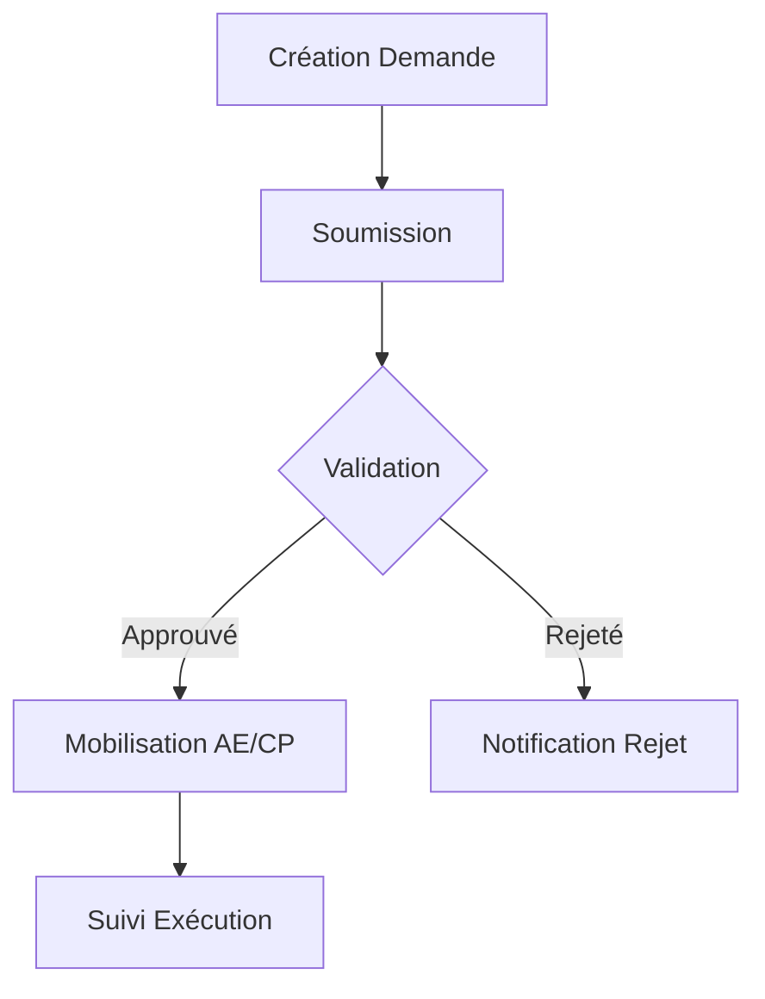
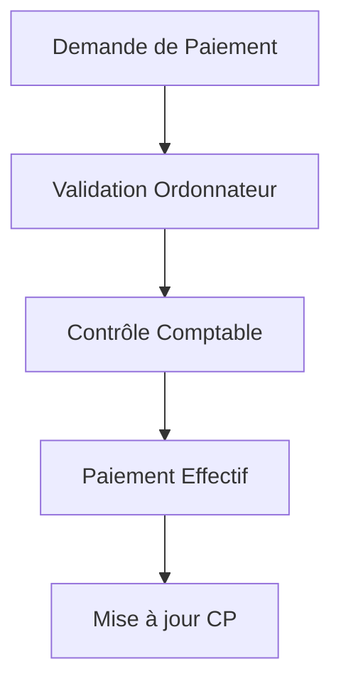

# Module "Demandes" - Présentation

## 🎯 **Objectif du module "Demandes"**

Le module **Demandes** permet de **centraliser, suivre et gérer toutes les demandes de financement** émanant des ministères ou institutions dans le cadre du cycle budgétaire LOLF. Il sert de point d’entrée pour la saisie, la consultation, la modification et le suivi du statut des demandes (nouvelle inscription, réévaluation, crédit de paiement, etc.).

---

### **Explication détaillée**

- **Centralisation des demandes** : Toutes les demandes de crédits (AE/CP), qu’il s’agisse de nouveaux projets, de réévaluations ou de besoins exceptionnels, sont enregistrées dans ce module.
- **Workflow complet** : Chaque demande suit un cycle de vie : création, soumission, révision, approbation ou rejet, avec traçabilité des statuts.
- **Gestion des priorités et classifications** : Les demandes sont catégorisées par type, priorité, ministère, année fiscale, etc., pour faciliter l’analyse et la planification.
- **Suivi financier** : Le module permet de renseigner et de visualiser les montants demandés (AE/CP), d’analyser les totaux par statut, ministère ou type de demande.
- **Transparence et traçabilité** : Chaque action (création, modification, suppression) est historisée, ce qui garantit la conformité avec les exigences de contrôle et d’audit.
- **Intégration au workflow LOLF** : Ce module s’inscrit dans la chaîne budgétaire globale (prévision, exécution, réévaluation, paiement), en lien avec les autres modules (engagements, paiements, prévisions CP).

---

**En résumé** :  
Le module "Demandes" est le point de départ du processus budgétaire, assurant la saisie structurée, le suivi et la validation des besoins financiers des ministères, tout en garantissant la traçabilité et l’alignement avec les règles LOLF

Voici une explication synthétique du module **Engagements** en français, sans format Markdown :

---

### Objectif du module "Engagements"

Le module Engagements permet de gérer, suivre et valider tous les engagements budgétaires liés aux opérations et projets financés par l’État. Il s’inscrit dans le workflow LOLF et assure la traçabilité de chaque étape d’engagement, depuis la création jusqu’à la liquidation.

**Explication détaillée :**

- Centralisation : Toutes les décisions d’engager des crédits (contrats, bons de commande, marchés, etc.) sont saisies dans ce module, avec leurs montants, bénéficiaires, dates et références.
- Cycle de vie complet : Chaque engagement suit un processus : création, soumission, révision, approbation, validation, liquidation ou rejet, avec un historique détaillé des statuts.
- Contrôle budgétaire : Le module vérifie la disponibilité des crédits avant validation, pour garantir le respect des plafonds budgétaires.
- Suivi financier : Il permet de visualiser les montants engagés, approuvés, liquidés, ainsi que le taux de consommation du budget par opération, type ou bénéficiaire.
- Réévaluations et ajustements : Les engagements peuvent être réévalués (hausse ou baisse du montant) en fonction de l’avancement des projets ou des besoins exceptionnels.
- Transparence et auditabilité : Toutes les actions sont historisées, ce qui facilite les contrôles, audits et le reporting.
- Intégration : Le module est connecté aux opérations, aux paiements et aux autres modules du SIGB pour assurer la cohérence du processus budgétaire.

**En résumé :**  
Le module Engagements est le cœur du suivi de l’exécution budgétaire. Il garantit que chaque dépense engagée est justifiée, validée, traçable et conforme aux règles de gestion publique.

# Structure de l'écosystème budgétaire LOLF

## 1. **Année Fiscale (Fiscal Year)**

L'année fiscale représente la période comptable fondamentale autour de laquelle s'organise tout le cycle budgétaire.

**Caractéristiques :**

- **Durée standardisée** : Période de 12 mois correspondant généralement à l'année civile
- **Statuts possibles** : draft (brouillon), planning (planification), active (en cours), closed (clôturée)
- **Point de référence** : Toutes les allocations, consommations et métriques budgétaires sont liées à une année fiscale spécifique
- **Indicateurs clés** : Total des AE/CP alloués et consommés, taux d'exécution, nombre de programmes/ministères

**Rôle dans le système :**

- Sert de conteneur principal pour l'ensemble des opérations budgétaires annuelles
- Permet la planification et le suivi des ressources financières sur un cadre temporel défini
- Facilite les comparaisons d'une année à l'autre pour évaluer les tendances budgétaires

## 2. **Portefeuilles (Portfolios)**

Les portefeuilles constituent le premier niveau de segmentation budgétaire, regroupant généralement les programmes sous la responsabilité d'un même ministère ou d'une même mission gouvernementale.

**Caractéristiques :**

- **Rattachement ministériel** : Chaque portefeuille est associé à un ministère spécifique
- **Agrégation budgétaire** : Consolide plusieurs programmes liés thématiquement
- **Attribution de crédits** : Dispose d'enveloppes globales d'AE/CP qui sont ensuite réparties entre les programmes
- **Indicateurs consolidés** : Permet d'avoir une vision agrégée de l'exécution budgétaire par ministère

**Rôle dans le système :**

- Facilite la coordination stratégique entre programmes connexes
- Permet un pilotage ministériel des priorités budgétaires
- Offre une vision consolidée pour les décideurs politiques et administratifs

## 3. **Programmes (Programs)**

Le programme représente l'unité fondamentale d'allocation des crédits dans la logique LOLF, correspondant à une politique publique précise.

**Caractéristiques :**

- **Types** : program (programme principal), subprogram (sous-programme), dotation
- **Structure hiérarchique** : Peut contenir des sous-programmes via le champ `parent_id`
- **Rattachement** : Appartient obligatoirement à un portefeuille
- **Statuts** : draft, active, archived
- **Budget dédié** : Dispose d'allocations spécifiques en AE (autorisations d'engagement) et CP (crédits de paiement)
- **Mesures de performance** : Objectifs, indicateurs et cibles de performance associés

**Rôle dans le système :**

- Constitue le niveau central de la gestion par performance
- Sert de cadre pour les décisions d'allocation de ressources
- Structure les activités gouvernementales en ensembles cohérents

## 4. **Actions**

Les actions représentent la déclinaison opérationnelle des programmes, précisant l'utilisation des crédits pour des finalités spécifiques.

**Caractéristiques :**

- **Types** : Centralized, Decentralized, Unique, Programmed, Complementary
- **Rattachement** : Chaque action est associée à un programme spécifique
- **Responsable désigné** : Une personne responsable de l'exécution (`responsible_id`)
- **Indicateurs d'avancement** : Suivi du taux d'exécution physique et financier
- **Budget propre** : Montants en AE/CP alloués et consommés
- **Temporalité** : Dates de début et de fin délimitant la période d'exécution

**Rôle dans le système :**

- Constitue l'unité opérationnelle permettant de suivre l'utilisation précise des crédits
- Permet de lier les ressources financières aux activités concrètes sur le terrain
- Sert de cadre pour les décisions d'engagement et de paiement

## 5. **Relations entre les entités**

L'ensemble forme une structure hiérarchique descendante permettant la traçabilité complète des crédits :

```
Année Fiscale
  └── Portefeuilles (par ministère)
       └── Programmes/Sous-programmes/Dotations
            └── Actions
                 └── Opérations
                      └── Engagements
                           └── Paiements
```

**Caractéristiques des relations :**

- **Année fiscale → Portefeuille** : Relation temporelle, un portefeuille existe sur plusieurs années
- **Portefeuille → Programme** : Relation d'appartenance (one-to-many)
- **Programme → Sous-programme** : Relation hiérarchique (parent-child)
- **Programme → Action** : Relation de composition (one-to-many)
- **Action → Opération** : Relation de mise en œuvre (une action se décline en opérations concrètes)

Cette structure pyramidale permet de :

- Suivre l'exécution budgétaire à différents niveaux de granularité
- Établir des responsabilités claires à chaque échelon
- Mesurer la performance en fonction des objectifs stratégiques
- Assurer la traçabilité complète des crédits, depuis l'allocation initiale jusqu'aux paiements finaux

Le système intègre également la gestion pluriannuelle des autorisations d'engagement (AE) et des crédits de paiement (CP), reflétant la réalité des projets publics qui s'étendent souvent sur plusieurs exercices budgétaires.

# Module "Opérations" - Présentation

## 🎯 **Objectif du module "Opérations"**

Le module **Opérations** est un élément essentiel du cycle budgétaire LOLF, dédié à la gestion détaillée des projets et investissements de l'État. Il établit le lien entre les aspects stratégiques (programmes, actions) et les réalisations concrètes sur le terrain.

---

## **Fonctions principales du module**

- **Gestion complète des projets d'investissement** : Création, modification, suivi et clôture des opérations budgétaires liées aux projets publics (infrastructures, équipements, etc.)

- **Suivi financier détaillé** : Enregistrement et suivi des allocations budgétaires (AE/CP), des engagements et des paiements pour chaque opération

- **Suivi physique** : Monitoring de l'avancement physique des projets, avec indicateurs de réalisation et de performance

- **Géolocalisation** : Localisation précise des projets (wilaya, commune) pour faciliter la répartition géographique des investissements publics

- **Rattachement hiérarchique** : Liaison directe avec les actions, programmes et portefeuilles, permettant une vision globale et cohérente du cadre de performance

- **Workflow de validation** : Circuit complet depuis la planification jusqu'à la réception finale, avec traçabilité des étapes et des décisions

---

## **Caractéristiques principales des opérations**

- **Informations d'identification** : Code unique, intitulé, description, catégorie, localisation
- **Profil administratif** : Ministère responsable, maître d'ouvrage, bénéficiaire, notification
- **Profil temporel** : Date d'inscription, année de démarrage, année de fin prévue, durée, délais
- **Données financières** : AE initiales/révisées, CP alloués/consommés, rythme de consommation
- **Données physiques** : Taux d'avancement, étapes clés, photos récentes, observations
- **Statuts possibles** : Planifiée, En cours, Retardée, Complétée, Annulée
- **Documents associés** : Notices, rapports d'avancement, PVs, documentation technique

---

## **Intégration dans le cycle budgétaire**

Le module Opérations constitue le **maillon opérationnel** entre la programmation budgétaire stratégique et l'exécution des dépenses au niveau le plus fin. Il permet de :

- Transformer les décisions de politique publique en projets concrets
- Mesurer l'efficacité de la dépense publique via des indicateurs physiques et financiers
- Assurer la traçabilité complète des investissements publics
- Faciliter le reporting et l'analyse de performance budgétaire

---

En tant que niveau le plus granulaire du cadre budgétaire LOLF, les opérations constituent le socle sur lequel reposent les engagements juridiques et les paiements, formant ainsi le lien indispensable entre les objectifs stratégiques des programmes et leur concrétisation sur le terrain.

# Module "Engagements" - Présentation détaillée

## 🎯 **Objectif du module "Engagements"**

Le module **Engagements** constitue l'élément central du processus d'exécution budgétaire. Il permet de gérer, suivre et valider tous les engagements juridiques qui matérialisent l'utilisation des autorisations d'engagement (AE) attribuées aux opérations budgétaires.

---

## **Fonctions principales du module**

- **Enregistrement et gestion** : Saisie, modification et suivi de tous les types d'engagements (marchés publics, contrats, bons de commande, conventions, etc.)

- **Workflow d'approbation** : Parcours complet depuis la création d'un engagement (draft) jusqu'à sa liquidation, avec des étapes intermédiaires (soumission, révision, approbation, validation)

- **Suivi financier** : Monitoring des montants engagés, approuvés, révisés, liquidés par année fiscale, opération, bénéficiaire

- **Contrôle budgétaire** : Vérification de la disponibilité des crédits (AE) pour chaque engagement avant validation

- **Réévaluations** : Gestion des modifications de montants (augmentations ou diminutions) des engagements en cours d'exécution

- **Gestion des bénéficiaires** : Suivi des prestataires, fournisseurs et autres tiers bénéficiaires des engagements

- **Statistiques et analyse** : Tableaux de bord permettant d'analyser la répartition, l'évolution et le statut des engagements

---

## **Types d'engagements**

Le système prend en charge différentes catégories d'engagements, dont :

- **Legal** (juridique) : Contrats formels et engagements juridiquement contraignants
- **Provisional** (provisionnel) : Engagements prévisionnels avant formalisation définitive
- **Technical** (technique) : Engagements liés à des prestations techniques spécifiques
- **Multiannual** (pluriannuel) : Engagements s'étendant sur plusieurs exercices budgétaires
- **Carryover** (report) : Engagements reportés d'un exercice précédent
- **Revaluation** (réévaluation) : Modification d'un engagement existant
- **Disbursement** (décaissement) : Engagements liés aux paiements échelonnés
- **Reallocation** (réaffectation) : Transferts entre engagements
- **Off-budget** (hors budget) : Engagements exceptionnels hors cadre budgétaire standard

---

## **Cycle de vie d'un engagement**

Un engagement dans le système suit une progression à travers plusieurs statuts :

1. **Draft** (brouillon) : Création initiale de l'engagement
2. **Submitted** (soumis) : Proposé pour approbation
3. **Reviewed** (examiné) : Vérifié par les services compétents
4. **Approved** (approuvé) : Validation du montant et des conditions
5. **Rejected** (rejeté) : Refus de l'engagement pour diverses raisons
6. **Validated** (validé) : Confirmation finale après approbation
7. **Liquidated** (liquidé) : Engagement totalement consommé/payé

---

## **Tableaux de bord et analyses**

Le module offre des fonctionnalités avancées d'analyse et de visualisation :

- **Répartition par statut** : Vue d'ensemble des engagements selon leur étape dans le workflow
- **Distribution mensuelle** : Analyse de la saisonnalité des engagements
- **Analyse par type** : Répartition selon les catégories d'engagements
- **Suivi de consommation** : Taux d'utilisation des engagements approuvés
- **Top bénéficiaires** : Classement des fournisseurs par volume ou montant d'engagements

---

## **Intégration dans le cycle budgétaire LOLF**

Le module Engagements s'insère entre les Opérations (qui fournissent les AE) et les Paiements (qui consomment les CP). Il représente le moment clé où les intentions budgétaires se transforment en obligations juridiques pour l'État, matérialisant ainsi le passage de la programmation à l'exécution budgétaire.

1. Les Engagements consomment les AE disponibles au niveau des Opérations
2. Les Engagements validés génèrent des CP à décaisser
3. Les Paiements sont effectués sur la base des engagements approuvés

Cette articulation garantit la traçabilité complète des crédits depuis leur autorisation jusqu'à leur consommation effective.

---

**En résumé** : Le module Engagements est le pivot de l'exécution budgétaire, transformant les autorisations de dépenses en obligations contractuelles. Il permet un contrôle rigoureux des dépenses publiques tout en offrant la flexibilité nécessaire pour adapter les engagements aux réalités du terrain via les mécanismes de réévaluation et d'ajustement.

# Module "Crédits de Paiement" - Présentation détaillée

## 🎯 **Objectif du module "Crédits de Paiement"**

Le module **Crédits de Paiement (CP)** s'inscrit dans la logique LOLF de gestion budgétaire en mode AE/CP. Il permet de gérer, suivre et valider les demandes et allocations des crédits de paiement nécessaires pour honorer les engagements juridiques pris antérieurement.

---

## **Fonctions principales du module**

- **Gestion des demandes** : Création, modification, soumission, approbation et suivi des demandes de crédits de paiement liées aux opérations budgétaires en cours

- **Allocation et suivi** : Attribution des CP aux opérations selon les besoins financiers réels et l'avancement physique des projets

- **Workflow d'approbation** : Circuit complet depuis la soumission d'une demande de CP jusqu'à son approbation ou rejet

- **Traçabilité complète** : Historisation de toutes les actions et décisions pour garantir la transparence et la responsabilité

- **Tableaux de bord** : Visualisation des CP alloués, consommés, restants, par opération, par année fiscale, par ministère et par statut

- **Contrôle budgétaire** : Vérifications automatiques des plafonds, des disponibilités et de la cohérence temporelle des CP

---

## **Caractéristiques principales des Crédits de Paiement**

- **Rattachement opérationnel** : Chaque demande de CP est liée à une opération spécifique
- **Année fiscale** : Appartenance à un exercice budgétaire précis
- **Montant** : Valeur précise du crédit demandé ou alloué
- **Justification** : Description et motifs de la demande
- **Statuts possibles** : draft (brouillon), submitted (soumis), reviewed (examiné), approved (approuvé), rejected (rejeté)
- **Temporalité** : Dates de création, de modification et d'approbation

---

## **Cycle de vie d'un Crédit de Paiement**

1. **Création** : Saisie initiale de la demande de CP (état "draft")
2. **Soumission** : Envoi pour examen (état "submitted")
3. **Examen** : Vérification par les autorités compétentes (état "reviewed")
4. **Décision** : Approbation ou rejet de la demande
   - **Approbation** : Le CP est alloué à l'opération (état "approved")
   - **Rejet** : La demande est refusée (état "rejected")
5. **Utilisation** : Consommation du CP lors des paiements effectifs

---

## **Intégration dans le cycle budgétaire LOLF**

Dans la logique LOLF, les Crédits de Paiement sont complémentaires aux Autorisations d'Engagement (AE) :

- **AE** : Autorisent l'engagement juridique initial (lors de la signature d'un contrat, par exemple)
- **CP** : Permettent le paiement effectif au fur et à mesure de l'exécution des travaux ou prestations

Le module CP est donc directement lié aux modules :

- **Opérations** : Les opérations génèrent les besoins en CP pour leur exécution
- **Engagements** : Les engagements juridiques définissent les montants qui nécessiteront des CP
- **Paiements** : Les paiements consomment les CP alloués

Cette articulation garantit la soutenabilité budgétaire en distinguant l'autorisation de contracter (AE) de l'autorisation de décaisser (CP).

---

## **Vues et analyses disponibles**

Le module propose plusieurs vues adaptées aux besoins de gestion :

- **En attente** : Demandes soumises nécessitant une approbation
- **Approuvés** : CP validés et disponibles pour utilisation
- **Historique** : Vue complète de toutes les demandes de CP traitées

Des filtres de recherche avancés permettent d'affiner l'affichage selon différents critères (opération, montant, date, etc.).

---

**En résumé** : Le module "Crédits de Paiement" est un élément essentiel du pilotage de la trésorerie et de l'exécution budgétaire. Il assure que les ressources financières sont disponibles au moment opportun pour honorer les engagements pris par l'État, tout en maintenant un contrôle strict sur les flux financiers.

Je vais fournir une explication détaillée du module PrevisionCP basée sur les documents fournis.

# Module PrevisionCP - Analyse Détaillée

## 1. Objectif Principal

Le module PrevisionCP est conçu pour :

- Gérer les prévisions des Crédits de Paiement (CP)
- Suivre la mobilisation des fonds
- Planifier les besoins en CP par période
- Contrôler l'exécution budgétaire

## 2. Structure des Données

### Table `prevision_cp`

```sql
- id: UUID (clé primaire)
- programme_id: UUID (clé étrangère)
- exercice: INT (année)
- periode: VARCHAR (ex: 2024-Q1)
- montant_prevu: DECIMAL
- montant_demande: DECIMAL
- montant_mobilise: DECIMAL
- montant_consomme: DECIMAL
- statut: ENUM ('prévu', 'demandé', 'mobilisé', 'en retard', 'partiellement mobilisé')
- date_soumission: DATE
- notes: TEXT
```

## 3. Fonctionnalités Principales

### 3.1 Gestion des Prévisions

- Création de nouvelles prévisions CP
- Modification des prévisions existantes
- Suppression des prévisions
- Visualisation détaillée des prévisions

### 3.2 Filtres et Recherche

- Par année (exercice)
- Par trimestre
- Par statut
- Par ministère/programme
- Recherche textuelle

### 3.3 Suivi des Montants

- Montant prévu
- Montant demandé
- Montant mobilisé
- Montant consommé
- Calcul des écarts et pourcentages

### 3.4 Visualisations

- Vue liste détaillée
- Vue graphiques et statistiques
- Tableaux de bord avec indicateurs clés

## 4. Workflow Opérationnel

```mermaid
1. Création Prévision →
2. Demande Mobilisation →
3. Validation DGB →
4. Mobilisation CP →
5. Consommation CP
```

## 5. États d'une Prévision

- **Prévu**: Prévision initiale créée
- **Demandé**: Demande de mobilisation soumise
- **Mobilisé**: CP disponibles pour utilisation
- **En retard**: Mobilisation non effectuée dans les délais
- **Partiellement mobilisé**: Mobilisation partielle des CP

## 6. Fonctionnalités Spécifiques

### 6.1 Reporting et Export

- Génération de rapports détaillés
- Export PDF des prévisions
- Export des données en Excel

### 6.2 Alertes et Notifications

- Retard de mobilisation
- Écarts significatifs
- Suivi des deadlines

## 7. Interface Utilisateur

### 7.1 Composants Principaux

- Dashboard avec statistiques
- Tableau des prévisions
- Formulaires de création/modification
- Filtres avancés
- Graphiques de suivi

### 7.2 Actions Disponibles

- Création nouvelle prévision
- Modification prévision existante
- Demande de mobilisation
- Génération de rapports
- Export de données

## 8. Intégration avec d'autres Modules

- Lien avec le module Engagements
- Connexion avec le module Paiements
- Interface avec le module Rapports
- Synchronisation avec le module Budget

## 9. Sécurité et Contrôles

- Validation des montants
- Vérification des droits utilisateurs
- Historique des modifications
- Traçabilité des actions

Cette documentation fournit une vue d'ensemble complète du module PrevisionCP, en se basant sur le code source, le PRD et le workflow fournis.
Je vais fournir une analyse détaillée du module Requests basée sur le code, le PRD et le Workflow.

# Module Requests - Analyse Détaillée

## 1. Objectif Principal

Le module Requests gère les demandes de financement des ministères avec:

- Suivi complet des demandes (création, modification, approbation)
- Gestion des montants AE (Autorisations d'Engagement) et CP (Crédits de Paiement)
- Workflow de validation multi-niveaux
- Reporting et statistiques

## 2. Structure des Données

### Table `requests`

```typescript
interface Request {
  id: string;
  title: string;
  ref: string;
  type: RequestType;
  status: RequestStatus;
  priority: "high" | "medium" | "low";
  ae_amount: number;
  cp_amount: number;
  ministry_id: string;
  fiscal_year_id: string;
  date_submitted: string;
  description?: string;
  comments?: string;
}
```

## 3. Fonctionnalités Principales

### 3.1 Dashboard Statistique

- Aperçu des demandes
- Stats financières
- Top ministères
- Indicateurs de performance

### 3.2 Gestion des Demandes

```typescript
-Création(handleAddRequest) - Modification(handleUpdateRequest) - Suppression(handleDeleteRequest) - Consultation(viewDialog);
```

### 3.3 Filtres et Recherche

- Par statut (all/pending/approved/rejected)
- Par texte (titre, référence)
- Par ministère
- Par année fiscale

## 4. Workflow Opérationnel



## 5. États d'une Demande

```typescript
const statusMap = {
  approved: <Badge variant="success">Approuvé</Badge>,
  submitted: <Badge variant="default">Soumis</Badge>,
  reviewed: <Badge variant="warning">En révision</Badge>,
  rejected: <Badge variant="destructive">Rejeté</Badge>,
  draft: <Badge variant="outline">Brouillon</Badge>,
};
```

## 6. Interface Utilisateur

### 6.1 Composants Principaux

- Dashboard avec statistiques
- Table des demandes (ReusableDataTable)
- Formulaires modaux (Add/Edit/View)
- Filtres et recherche

### 6.2 Actions Disponibles

```typescript
const actionHandlers = {
  onView: (data) => setViewDialogOpen(true),
  onEdit: (data) => setEditDialogOpen(true),
  onDelete: (data) => handleDeleteRequest(),
};
```

## 7. Intégration

### 7.1 Avec d'autres Modules

- Budgets (vérification disponibilité)
- Engagements (création après approbation)
- Prévisions CP (planification)
- Reporting (statistiques)

### 7.2 Workflow LOLF

- Respect de la chaîne de validation
- Traçabilité des décisions
- Contrôle budgétaire
- Reporting conforme

## 8. Sécurité et Contrôles

### 8.1 Validation des Données

- Montants obligatoires
- Dates cohérentes
- Justificatifs requis
- Workflow respecté

### 8.2 Audit

- Historique des modifications
- Traçabilité des validations
- Journal des actions

## 9. Points Forts

1. Interface intuitive et moderne
2. Dashboard complet avec KPIs
3. Workflow structuré
4. Suivi financier détaillé
5. Export de données
6. Filtres avancés

## 10. Suggestions d'Amélioration

1. Ajout notifications temps réel
2. Workflow plus détaillé
3. Intégration signature électronique
4. Rapports personnalisables
5. Mode hors-ligne
6. Archivage automatique

Cette analyse montre un module bien structuré, aligné avec les exigences du PRD et respectant le workflow LOLF défini.

# Module Payments - Analyse Détaillée

## 1. Objectif Principal

Le module Payments gère l'ensemble du cycle de vie des paiements et demandes de paiement dans le système, en suivant la LOLF algérienne.

## 2. Structure des Données

### 2.1 Table Payments

```typescript
interface Payment {
  id: string;
  engagement_id: string;
  operation_id: string;
  amount: number;
  payment_date: string;
  status: "pending" | "approved" | "rejected" | "paid" | "draft";
  beneficiary: string;
  description: string;
  created_at: string;
}
```

### 2.2 Table PaymentRequests

```typescript
interface PaymentRequest {
  id: string;
  engagement_id: string;
  operation_id: string;
  requested_amount: number;
  requestDate: string;
  period: string;
  frequency: "monthly" | "quarterly" | "annual";
  justification: string | null;
  status: "draft" | "pending" | "reviewed" | "approved" | "rejected";
  document: string | null;
  beneficiary: string;
  description: string;
}
```

## 3. Fonctionnalités Principales

### 3.1 Dashboard Statistique

- Total des paiements
- Montants payés
- Montants en attente
- Montants rejetés
- Graphiques de répartition
- Activité récente

### 3.2 Gestion des Paiements

```typescript
const paymentMutation = usePaymentMutation({
  onSuccess: () => {
    refetchPayments();
    // Notifications de succès
  },
  onError: (error) => {
    // Gestion des erreurs
  },
});
```

### 3.3 Workflow de Validation

1. Création de la demande
2. Validation par l'agent comptable
3. Approbation finale
4. Paiement effectif
5. Suivi post-paiement

## 4. Interface Utilisateur

### 4.1 Vues Principales

- Liste des paiements
- Demandes de paiement
- Statistiques et KPIs
- Historique des transactions

### 4.2 Filtres et Recherche

```typescript
const filteredPayments = payments.filter((payment) => {
  const matchesSearch =
    payment.description?.toLowerCase().includes(searchQuery.toLowerCase()) ||
    payment.beneficiary.toLowerCase().includes(searchQuery.toLowerCase()) ||
    formatCurrency(payment.amount).includes(searchQuery);
});
```

## 5. États des Paiements

### 5.1 Statuts Possibles

```typescript
const statusMap = {
  pending: "En attente",
  pending_officer: "En attente de l'agent",
  pending_accountant: "En attente du comptable",
  approved: "Approuvé",
  rejected: "Rejeté",
  paid: "Payé",
};
```

## 6. Actions Disponibles

### 6.1 Gestion des Paiements

```typescript
const actions = {
  handleAddNewPayment,
  handleViewPayment,
  handleEditPayment,
  handleDeletePayment,
};
```

### 6.2 Gestion des Demandes

```typescript
const requestActions = {
  handleAddNewRequest,
  handleViewRequest,
  handleEditRequest,
  handleDeleteRequest,
  handleApproveRequest,
  handleRejectRequest,
};
```

## 7. Intégration

### 7.1 Avec d'autres Modules

- Engagements (vérification disponibilité)
- Budgets (contrôle budgétaire)
- Reporting (statistiques)
- Audit (traçabilité)

### 7.2 API Supabase

```typescript
const {
  data: paymentsData,
  isLoading: isLoadingPayments,
  refetch: refetchPayments,
} = usePayments({
  staleTime: 1000 * 60 * 5, // 5 minutes
});
```

## 8. Sécurité et Contrôles

### 8.1 Validation des Données

- Montants conformes
- Bénéficiaires valides
- Dates cohérentes
- Documents requis

### 8.2 Audit Trail

- Historique des modifications
- Traçabilité des validations
- Journal des actions

## 9. Reporting

### 9.1 Rapports Disponibles

- État des paiements
- Suivi des demandes
- Statistiques périodiques
- Écarts et anomalies

### 9.2 Exports

- PDF
- Excel
- Données brutes

## 10. Conformité LOLF

### 10.1 Principes Respectés

- Séparation ordonnateur/comptable
- Validation multi-niveaux
- Justification des dépenses
- Traçabilité complète

### 10.2 Workflow LOLF



Cette documentation fournit une vue complète du module Payments, alignée avec les exigences du PRD et le workflow LOLF défini.

# Module Operations - Analyse Détaillée

## 1. Objectif Principal

Le module Operations est un composant central du système SIGB qui gère le cycle de vie complet des opérations d'investissement selon la LOLF algérienne. Il permet de :

- Planifier les opérations d'investissement
- Allouer et suivre les AE/CP (Autorisations d'Engagement/Crédits de Paiement)
- Surveiller l'exécution physique et financière
- Générer des statistiques et rapports de suivi

## 2. Structure des Données

### 2.1 Table `operations`

```sql
CREATE TABLE IF NOT EXISTS operations (
    id UUID PRIMARY KEY DEFAULT gen_random_uuid(),
    -- Relations
    portfolio_id UUID REFERENCES actions(id) ON DELETE CASCADE,
    program_id UUID REFERENCES programs(id),
    action_id UUID REFERENCES actions(id),
    wilaya_id UUID REFERENCES wilayas(id),
    budget_title_id UUID REFERENCES budget_titles(id),
    portfolio_program TEXT,
    program_type TEXT,

    -- Informations générales
    code TEXT,
    name TEXT,
    description TEXT,
    province TEXT,
    municipality TEXT,
    location TEXT,
    beneficiary TEXT,
    project_owner TEXT,
    regional_budget_directorate TEXT,

    -- Détails administratifs
    individualization_number TEXT,
    notification_year TEXT,
    inscription_date DATE,

    -- Durée du projet
    start_year INTEGER,
    end_year INTEGER,
    start_order_date TEXT,
    completion_date TEXT,
    delay NUMERIC,

    -- Données financières
    initial_ae NUMERIC,
    current_ae NUMERIC,
    allocated_ae NUMERIC,
    committed_ae NUMERIC,
    consumed_ae NUMERIC,
    allocated_cp NUMERIC,
    notified_cp NUMERIC,
    consumed_cp NUMERIC,
    cumulative_commitments NUMERIC,
    cumulative_payments NUMERIC,

    -- Suivi de l'exécution
    physical_rate NUMERIC,
    financial_rate NUMERIC,
    recent_photos TEXT[],
    observations TEXT,

    -- Mode d'exécution et statut
    execution_mode TEXT CHECK (execution_mode IN ('state', 'delegation', 'PPP')),
    project_status TEXT CHECK (
        project_status IN (
            'not_started', 'planned', 'in_progress', 'completed',
            'on_hold', 'suspended', 'delayed', 'canceled',
            'completely_frozen', 'partially_frozen'
        )
    ),
    status TEXT CHECK (
        status IN ('draft', 'submitted', 'reviewed', 'approved', 'rejected')
    ) DEFAULT 'draft'
)
```

## 3. Interface Utilisateur

### 3.1 Structure de la Page

- **Dashboard** : Vue synthétique des indicateurs clés
- **Liste des opérations** : Tableau des opérations avec filtres avancés
- **Actions** : Boutons pour ajouter, modifier, supprimer, consulter
- **Formulaires** : Modales pour la saisie et la modification des données

### 3.2 Composants Principaux

- `OperationsDashboard` : Statistiques et KPIs
- `OperationsTable` : Liste paginée des opérations
- `OperationsFilter` : Filtres multiples (wilaya, portfolio, status)
- `OperationViewDialog` : Consultation détaillée
- `OperationFormDialogs` : Formulaires d'ajout/modification/suppression

## 4. Fonctionnalités Principales

### 4.1 Dashboard Opérationnel

```typescript
const OperationsDashboard = ({ operations }) => {
  // Calcul des indicateurs clés
  const totalOperations = operations.length;
  const totalAllocatedAE = operations.reduce((sum, op) => sum + (op.allocated_ae || 0), 0);
  const totalAllocatedCP = operations.reduce((sum, op) => sum + (op.allocated_cp || 0), 0);
  const totalConsumedAE = operations.reduce((sum, op) => sum + (op.consumed_ae || 0), 0);
  const totalConsumedCP = operations.reduce((sum, op) => sum + (op.consumed_cp || 0), 0);
};
```

### 4.2 Filtrage et Recherche

```typescript
const filteredOperations = filterOperations(
  operationsData,
  searchTerm,
  portfolioFilter,
  wilayaFilter,
  statusFilter,
  titreBudgetaireFilter,
  origineFinancementFilter
);
```

### 4.3 Gestion CRUD des Opérations

```typescript
// Création d'opération
const handleAddOperation = async () => {
  await operationMutation.mutateAsync({
    type: "INSERT",
    data: newOperation,
  });
};

// Modification d'opération
const handleEditOperation = async () => {
  await operationMutation.mutateAsync({
    type: "UPDATE",
    id: currentOperation.id,
    data: newOperation,
  });
};

// Suppression d'opération
const handleDeleteOperation = async () => {
  await operationMutation.mutateAsync({
    type: "DELETE",
    id: currentOperation.id,
  });
};
```

## 5. Intégration dans le Workflow LOLF

### 5.1 Positionnement dans le Cycle Budgétaire

```
Programme > Action > Opération > Engagement > Paiement
```

L'Opération constitue l'unité de base pour :

- L'allocation des Autorisations d'Engagement (AE)
- La planification des Crédits de Paiement (CP)
- Le suivi physique et financier

### 5.2 Relations avec les Autres Modules

- **Programmes/Actions** : Rattachement hiérarchique
- **Engagements** : Consommation des AE
- **Paiements** : Consommation des CP
- **Prévisions CP** : Planification pluriannuelle

## 6. Statuts et Workflow

### 6.1 Statut Administratif

```typescript
// Validation workflow
status: "draft" | "submitted" | "reviewed" | "approved" | "rejected";
```

### 6.2 État d'Avancement

```typescript
// Physical progress
project_status: "not_started" |
  "planned" |
  "in_progress" |
  "completed" |
  "on_hold" |
  "suspended" |
  "delayed" |
  "canceled" |
  "completely_frozen" |
  "partially_frozen";
```

### 6.3 Modes d'Exécution

```typescript
execution_mode: "state" | "delegation" | "PPP";
```

## 7. Analytics et Reporting

### 7.1 Indicateurs de Performance

- **Taux d'exécution physique** : Suivi de l'avancement des travaux
- **Taux d'exécution financier** : Consommation des crédits
- **Écarts** : Comparaison prévu/réalisé

### 7.2 Visualisations

- **Répartition par statut** : Graphique circulaire
- **Aperçu budgétaire** : Tabs pour AE/CP/Total
- **Progression** : Barres de progression par indicateur

## 8. Conformité avec la LOLF

### 8.1 Traçabilité Budgétaire

- Suivi complet des montants initiaux et révisés
- Historique des modifications
- Audit des actions

### 8.2 Suivi Multi-niveaux

- Par région (wilaya)
- Par secteur (titre budgétaire)
- Par source de financement

## 9. Sécurité et Contrôles

### 9.1 Validation des Données

- Vérification des montants AE/CP
- Cohérence des dates de projet
- Relations et références valides

### 9.2 Audit Trail

```typescript
// Activity tracking via separate audit table
const auditLog = {
  entity_type: "operation",
  entity_id: operation.id,
  action: "UPDATE",
  old_values: JSON.stringify(currentOperation),
  new_values: JSON.stringify(newOperation),
};
```

Cette analyse fournit une vue d'ensemble complète du module Operations dans le système SIGB, montrant son rôle central dans la gestion des investissements publics selon les principes de la LOLF algérienne.

# Module Dashboard - Analyse Détaillée

## 1. Objectif Principal

Le module Dashboard sert de point d'entrée stratégique pour le système SIGB en offrant une vue synthétique de l'exécution budgétaire selon les principes de la LOLF algérienne. Il permet aux décideurs et gestionnaires de :

- Visualiser l'état global du budget à travers des KPIs clés
- Suivre l'exécution budgétaire en temps réel
- Identifier rapidement les écarts ou anomalies
- Faciliter les décisions stratégiques basées sur des données consolidées

## 2. Structure du Dashboard

### 2.1 Vue d'Ensemble (Header)

```typescript
<DashboardHeader
  title={t("dashboard.title")}
  description={t("dashboard.welcome")}>
  <div className="flex items-center gap-3">
    <div className="w-52">
      <Select
        value={selectedYear}
        onValueChange={setSelectedYear}>
        // Sélection d'exercice fiscal
      </Select>
    </div>
    <Button
      onClick={handleGenerateReport}
      disabled={generatingPdf}>
      // Génération de rapport détaillé
    </Button>
  </div>
</DashboardHeader>
```

### 2.2 KPIs Financiers Principaux

Le dashboard affiche 4 indicateurs clés alignés avec les exigences de la LOLF :

- **Budget Total** : Enveloppe globale disponible
- **Budget Alloué** : Montant attribué aux programmes
- **Budget Utilisé** : Crédits effectivement consommés
- **Budget Restant** : Solde disponible

### 2.3 Répartition Budgétaire

Visualisations graphiques montrant :

- Distribution par ministère (sectorielle)
- État des engagements (engagés vs non-engagés)
- Taux d'exécution par programme

## 3. Fonctionnalités Principales

### 3.1 Filtrage par Exercice

```typescript
const [selectedYear, setSelectedYear] = useState(fiscalYears[0].id);
// Permet de visualiser les données de différents exercices fiscaux
```

### 3.2 Indicateurs de Performance

```typescript
// Calculs automatiques des indicateurs critiques
const currentFiscalYear = fiscalYears.find((year) => year.id === selectedYear);
const engagementRate = currentFiscalYear.engagementRate;
const paymentRate = currentFiscalYear.paymentRate;
```

### 3.3 Génération de Rapports

```typescript
const handleGenerateReport = () => {
  setGeneratingPdf(true);
  // Génération du PDF avec statistiques et graphiques
  setTimeout(() => {
    setGeneratingPdf(false);
    setIsPdfPreviewOpen(true);
  }, 1500);
};
```

### 3.4 Suivi des Approbations

Section dédiée aux engagements en attente d'approbation pour une prise de décision rapide.

### 3.5 Journal des Activités

Historique des dernières actions effectuées dans le système pour une traçabilité complète.

## 4. Intégration avec le Workflow LOLF

Le dashboard est conçu pour servir de tableau de bord à chaque étape du workflow LOLF :

### 4.1 Phase de Prévision Budgétaire

- Visualisation des budgets initiaux et des allocations
- Suivi des programmes et de leur avancement

### 4.2 Phase d'Exécution

- Tracking des engagements (AE) et paiements (CP)
- Alertes sur les écarts d'exécution

### 4.3 Phase d'Évaluation

- Visualisation des taux d'exécution physique et financière
- Analyse des écarts entre prévisions et réalisations

## 5. Visualisations Avancées

### 5.1 Graphiques Intégrés

```typescript
// Graphiques personnalisés pour les analyses financières
<BudgetChart title={t("dashboard.byMinistry")} data={currentFiscalYear.budgetData} />
<BudgetChart title={t("dashboard.engagementStatus")} data={currentFiscalYear.engagementData} />
```

### 5.2 Rapports PDF Détaillés

Le dashboard permet de générer des rapports complets incluant :

- Résumé de l'exécution budgétaire
- Graphiques de tendance mensuelle
- Distribution par ministère et programme
- Analyse des taux d'exécution

## 6. Alignement avec le PRD

Le dashboard implémente les spécifications du PRD :

- **Interface moderne** avec ShadCN UI et Tailwind CSS
- **Mode clair/sombre** pour l'ergonomie
- **Responsive design** pour différents appareils
- **Visualisations interactives** des données budgétaires
- **Export de rapports** au format PDF

## 7. Données Affichées

### 7.1 Données Budgétaires

```typescript
const fiscalYears = [
  {
    id: "fy1",
    year: 2024,
    totalBudget: 5000000000,
    allocated: 3100000000,
    paid: 2100000000,
    available: 1900000000,
    engagementRate: 62,
    paymentRate: 42,
    // Données de répartition...
  },
  // Autres exercices...
];
```

### 7.2 Suivi des Programmes

```typescript
programmesData: [
  {
    name: "Programme d'Éducation Nationale",
    allocation: 750000000,
    spent: 480000000,
    remaining: 270000000,
    progress: 64,
  },
  // Autres programmes...
];
```

## 8. Bénéfices Stratégiques

1. **Prise de Décision Éclairée** : Les décideurs ont accès à des données consolidées
2. **Transparence Budgétaire** : Conformité avec les principes de la LOLF
3. **Détection Précoce des Problèmes** : Identification rapide des écarts d'exécution
4. **Vision Consolidée** : Vue d'ensemble du cycle budgétaire
5. **Reporting Automatisé** : Génération de rapports standards et personnalisés

Cette analyse démontre que le module Dashboard constitue un élément fondamental du système SIGB, servant à la fois d'interface utilisateur principale et d'outil stratégique d'aide à la décision, tout en respectant les principes de la LOLF algérienne en matière de suivi et de transparence budgétaire.
